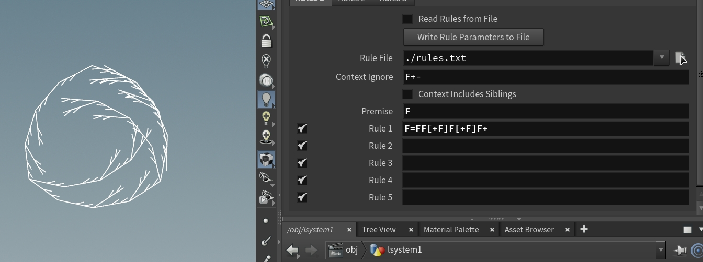
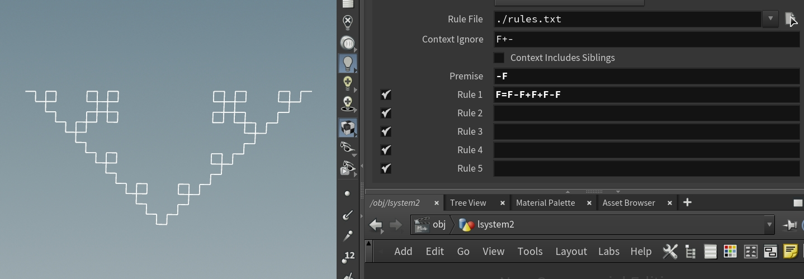
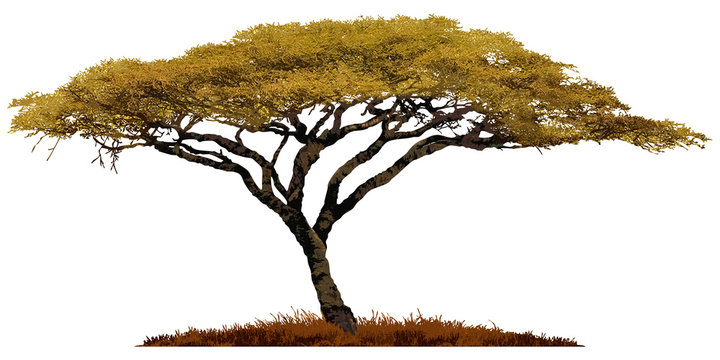
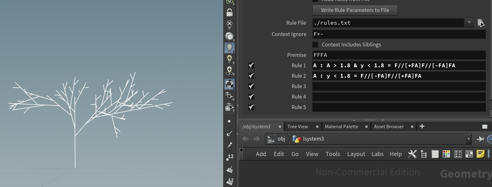

# lab03-grammars
## Zhen Ren

## 1. Wheat grammar puzzle
\

### Solution: `F=FF[+F]F[+F]F+`

## 2. Square grammar puzzle
\

### Solution: `F=F-F+F+F-F`

## 3. Acacia Tree

The goal is to mimic an acacia tree. The main challenge is to make a flatten top with random branches. Therefore, I used different conditions to restrct the growth when the y coordinate is above certain threshold and when the arc length is greater than certain value.

