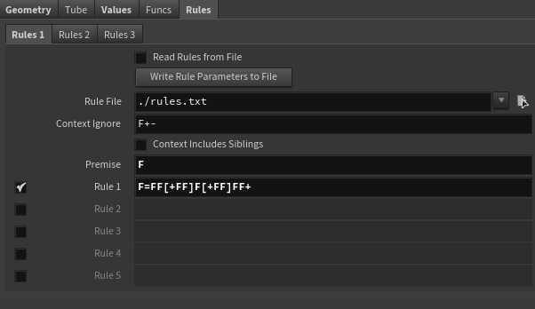
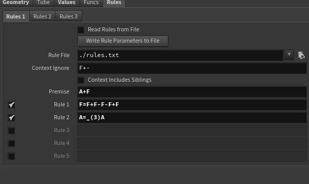
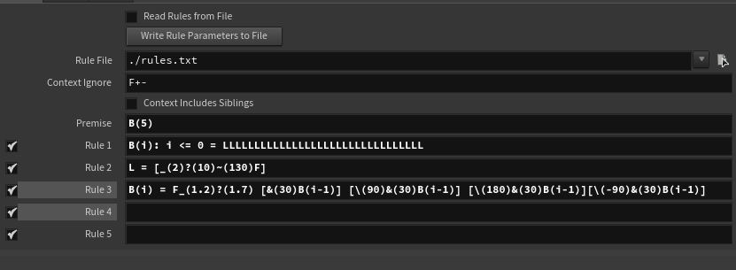
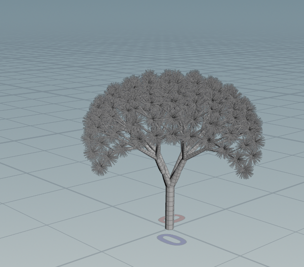
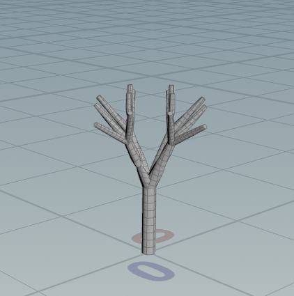

# lab03-grammars
Let's practice using grammars! For this lab, please pull up the L-system node in Houdini.

## Solutions
by Andrew Ding

1. with an angle of 20 degrees,

2. with an angle of 90 degrees,

3.

I chose the dragon blood tree.

reference:

rules for generation:

generated attempt (shown at 10 generations)

There are visually two distinct parts to the tree; the branches which multiply quickly and the leaves which are short and thin.

The leaves exhibit no fractal pattern, which made it very difficult to find rules that had no generation limit. Duplication with a L-system is mainly accomplished by duplicating a symbol (e.g. A <- AA) and allowing that symbol to generate fully. There is a symbol for the leaves, L, but that symbol can't be duplicated because the leaves should only be drawn once; consequently, the generation where L is replaced by draw commands is the last one. (It's probably possible to find a different solution with other L-system capabilities, but I think it would be arduous.) 

In this case, after the 7th generation the L-system is stationary. I used a symbol variable for B to keep track of the number of generations; B is also used to generate the branches, which were allowed to proliferate until the 6th generation. Random rotations of the branches ended up frequently looking bad; the tree was pretty much always asymmetric, so I just used four deterministically-rotated branches in each generation.

The results aren't perfect. A lot depends on the length/thickness scale per branch (in the B(i) rule), as well as the branch pitch (currently 30 degrees) each generation. I think that for a more accurate tree, the branch pitch can't be the same across all generations.

Because of the finite-generation approach, in the intermediate generations the tree is bare of leaves:

## 1. Wheat grammar puzzle
Look at these iterations (n = 1, 2, 3) of a one-rule grammar. Using the built in symbols in Houdini, design a grammar that produces this output. Take a screenshot of your rules.\

## 2. Square grammar puzzle
How about this one? Take a screenshot of your rules.\

## 3. Custom plant
Choose a plant in the world. Working off a reference, design a grammar that mimics the structure of that plant. Unlike our simple puzzles, please use multiple rules for greater complexity. Think carefully about the structure of your grammar! EXPLAIN the structure of your plant in the README. What are the components? What do each of the rules do? Be sure to also include images of a few iterations of your output plant. 

## Submission
- Create a pull request against this repository
- In your readme, list your solutions and format your README nicely
- Profit
