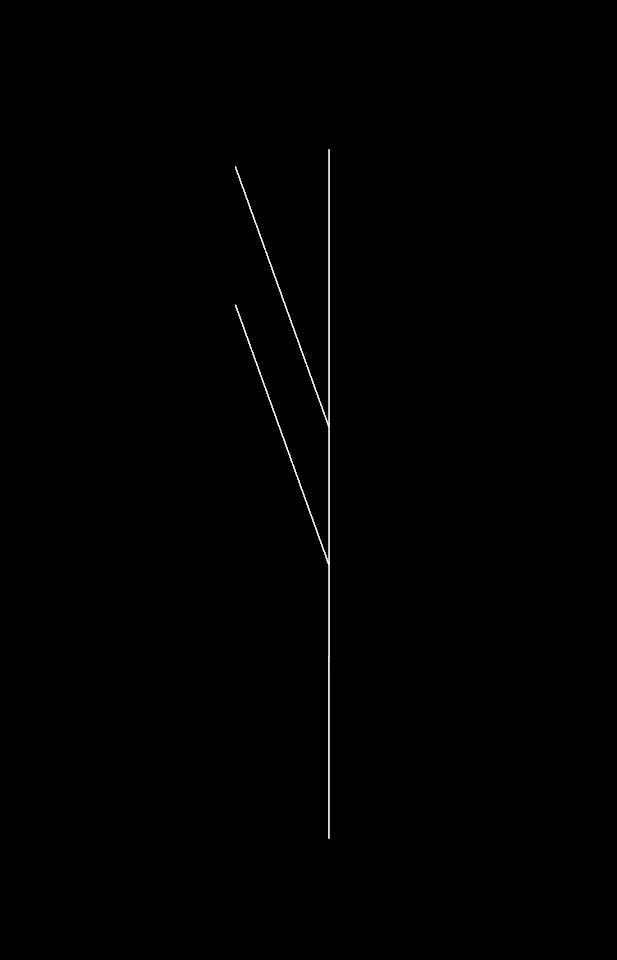
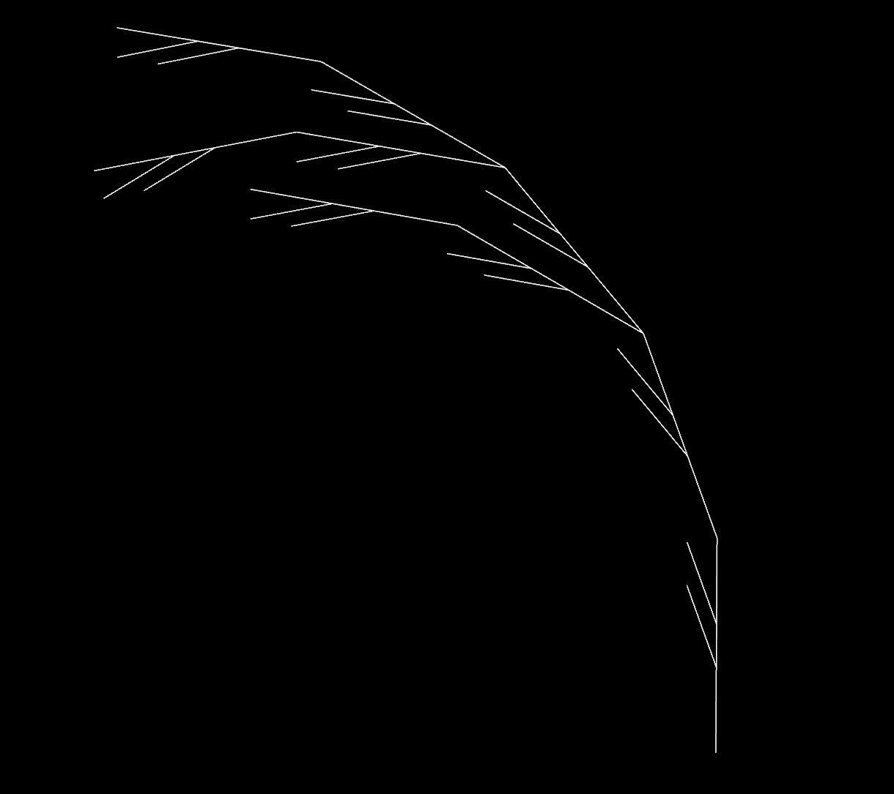
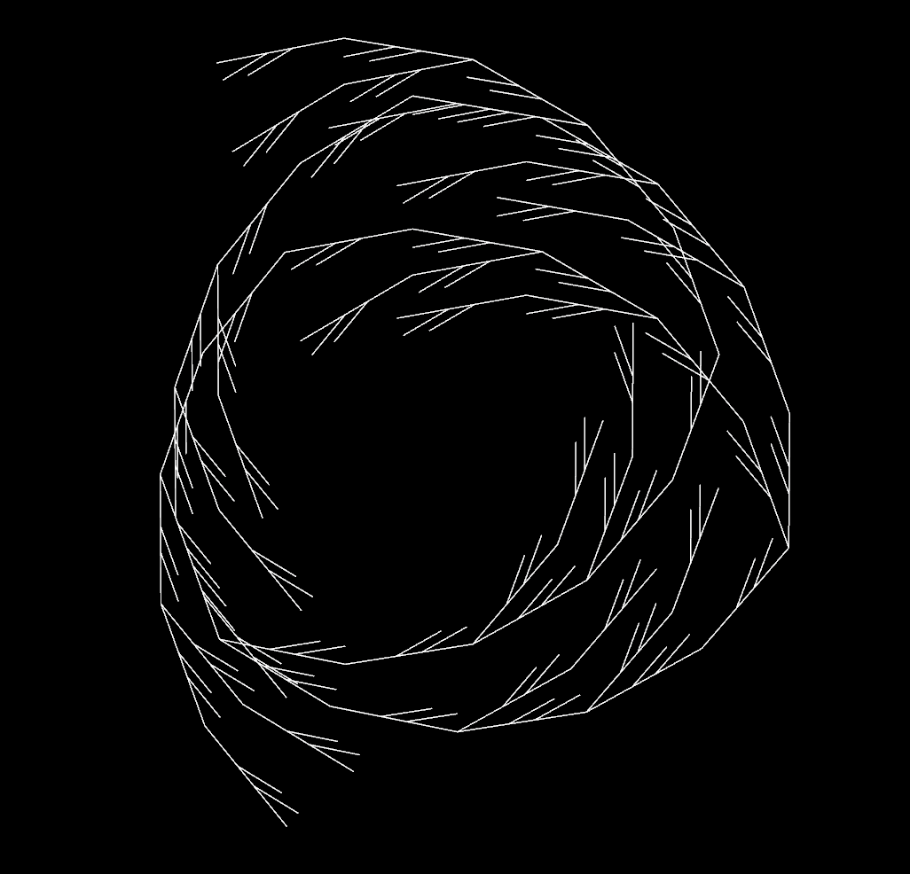
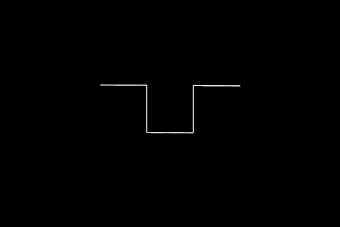
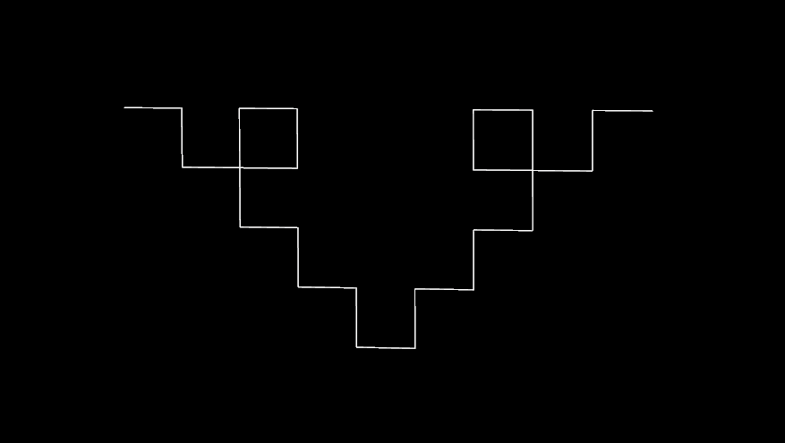
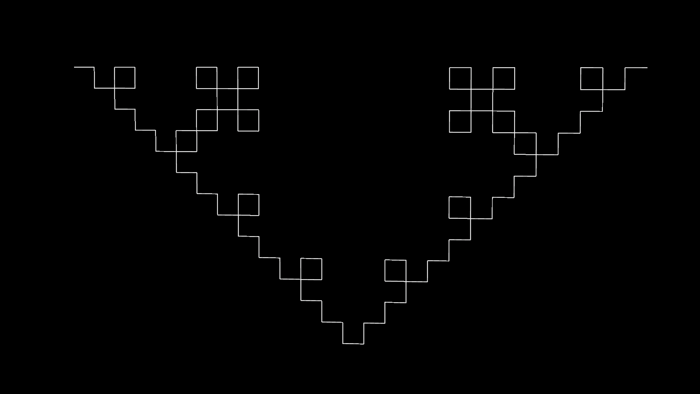
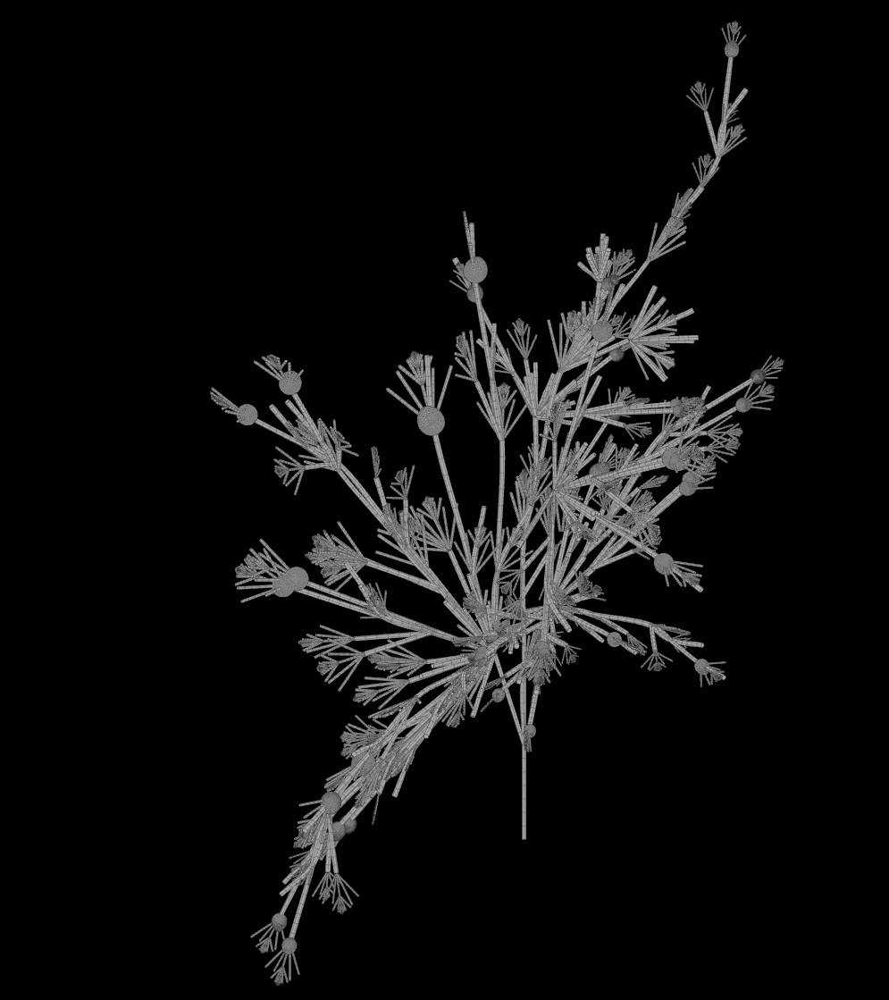
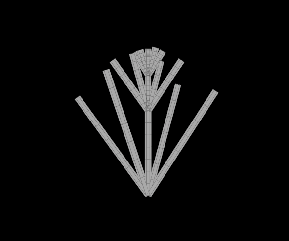
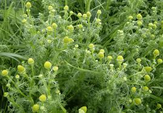

# lab03-grammars : Lewis Ghrist

## 1. Wheat Grammar Puzzle
Premise: F : Angle = 20 degrees
Rule 1: F=FF[+FF]F[+FF]FF+

## 2. Square grammar puzzle
Premise: +F : Angle = 90 degrees
Rule 1: F=F=F+F-F-F+F

## 3. Custom plant
Premise 1: FA : 5 Iterations
Rule 1: A=[+FKB][""F-/K//FB]FF/K//"+AJ
Rule 2: B=C[+\K\"C]
Rule 3: C=[+\\"FA][-//""F][+"FA][\\\\"F][-\\A\-""F]+C
Here J is a bulb shape made with a revolved tear drop shape made with a super formula and K is a secondary L-system:

Premise 2: A : 4 Iterations
Rule 1: A=B""FA
Rule 2: B=[;+"F][-";F][;+"+F][-;"-F]

The reference plant is a Pineapple weed:

