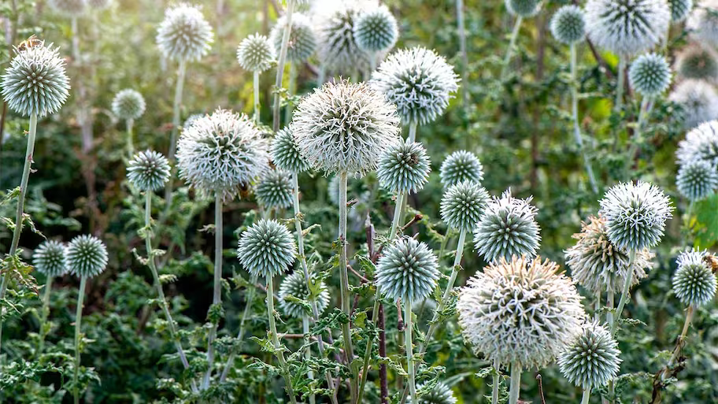
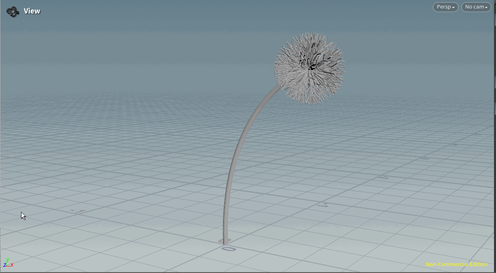

# lab03-grammars
Let's practice using grammars! For this lab, please pull up the L-system node in Houdini.

## 1. Wheat grammar puzzle
Look at these iterations (n = 1, 2, 3) of a one-rule grammar. Using the built in symbols in Houdini, design a grammar that produces this output. Take a screenshot of your rules.\

Solution:

Axiom: F

Rule 1: F=FF[+FF]F[+FF]FF+

Angle: 20 degrees

## 2. Square grammar puzzle
How about this one? Take a screenshot of your rules.\

Solution:

Axiom: +F

Rule 1: F=F+F-F-F+F

Angle: 90

## 3. Custom plant
Choose a plant in the world. Working off a reference, design a grammar that mimics the structure of that plant. Unlike our simple puzzles, please use multiple rules for greater complexity. Think carefully about the structure of your grammar! EXPLAIN the structure of your plant in the README. What are the components? What do each of the rules do? Be sure to also include images of a few iterations of your output plant. 

Reference image:

Houdini file in repo. Here is the L-system I set up (omitting some of the constants I used to change the width / length of certain segments, just to simplify explanation):

Axiom: F+TAC
- Explanation: Basic stem root. Move forward, rotate (default angle is like 3 degrees) and apply gravity (T), then AC are symbols defined later.

Rule 1: A=F+TA
- Replace A with a move-forward step, a rotation and gravity, and another A.
- The effect of this is to create a plant stem that adds one segment on each iteration, and progressively bends with gravity.

Rule 2: B=F[+(30)F][^(30)F][-(30)F][&(30)F]
- This rule creates a little four-sided spore that will be a single tip of the dandelion.
- Each spore is rotated by a different amount in two planes symmetrically.

Rule 3: C=+(360*rand(i))^(360*rand(i))[B]CC
- This rule represents the bulb. Per the axiom, C only ever appears exactly once, at the end of the sequence.
- The bulb takes a spore and orients it in a random direction spherically.
- [B]CC at the end of the rule implies that, with each iteration, the bulb gets denser with spores (more B's), and it gets denser faster than we add stem segments (CC, rather than just C).
  

## Submission
- Create a pull request against this repository
- In your readme, list your solutions and format your README nicely
- Profit
