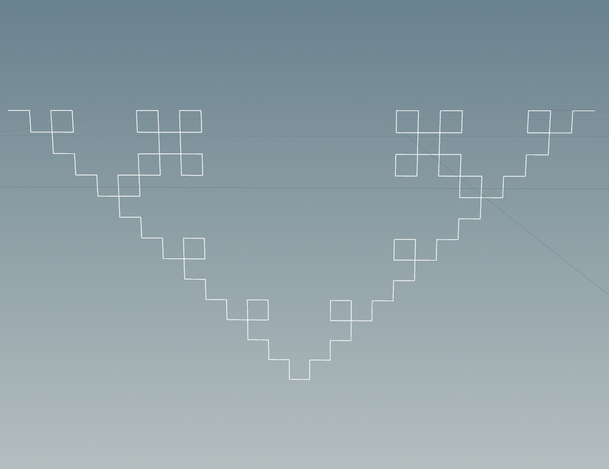

# lab03-grammars
Let's practice using grammars!

## 1. Wheat grammar puzzle
|  |  |  |
|:--:|:--:|:--:|
| *iterations=1* | *iterations=2* | *iterations=3* |

### Grammar

## 2. Square grammar puzzle

|  |  |  |
|:--:|:--:|:--:|
| *iterations=1* | *iterations=2* | *iterations=3* |

### Grammar

## 3. Custom plant

### Reference Image

|  | |
|:--:|:--:|
| *iterations=3* | *iterations=10* |

### Grammar

### Descrpition

I want to generate a plant with many flowers on it, so I use 2 rules to shape the outline: Rule 1 creates branching patterns, and Rule 2 adds more variation to the lines, leading to a natural, organic appearance.

Rule 1 causes X to generate a recursive pattern, with the current line splitting into multiple branches. The branches diverge at different angles, simulating a plant-like structure.

In Rule 2, F is being replaced with F+\F, meaning after drawing a line, the system will turn right slightly and draw another line. This causes the forward movement to have small deviations, adding complexity to the structure.

Finally, with some angle fine-tuning, it becomes a branch with many flowers, which is exactly what I want.
