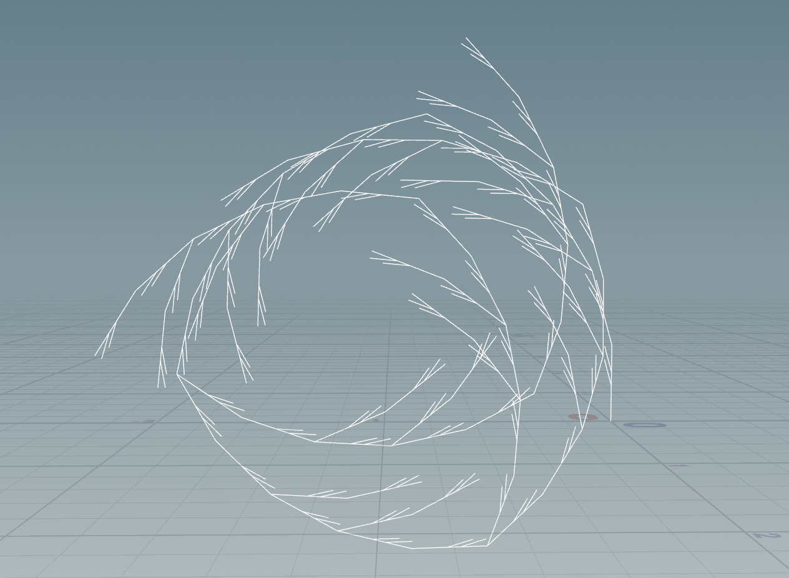

# 566lab3

Owner: Andy Wang
Tags: CG General

### 1. Wheat

with following rule:

### 2. Square

with following rule:

### 3. Custom Plant

Grammars that are applied:

Node structure:

Grammar explaination:

1. Premise: F(0.05)A
   1. F(0.05): override forward with width of 0.05
   2. A: applies custom rule A recursively
2. Rule1: A = "~(15)!F[^BBBBK]/(120)[^CCCJ]/(120)[^CCCM]A
   1. ~(15): random rotation `“~”` within 15 degrees
   2. !: represents the scaling to the tube
   3. `[^BBBK]`: Y-axis rotation and grow sevral rule B segments, adding a SOP geometry represented by K
   4. /(120): Z-axis rotation with an overwritten degree of 120
   5. [^CCCJ] and [^CCCM]: similar to `[^BBBK]`, in which J and M represent another 2 SOP geometry
   6. A: applies custom rule A recursively
3. Rule2: B = ~(20)!&(10)F(0.02)
   1. ~(20): random rotation `“~”` within 20 degrees
   2. !: scaling to the tube
   3. &(10): X-axis rotation with an overwritten degree of 10
   4. F(0.02): override forward with width of 0.05
4. C = ~(10)^(10)F(0.01)
   1. ~(10): random rotation `“~”` within 10 degrees
   2. ^(10): Y-axis rotation with an overwritten degree of 10
   3. F(0.01): override forward with width of 0.05
