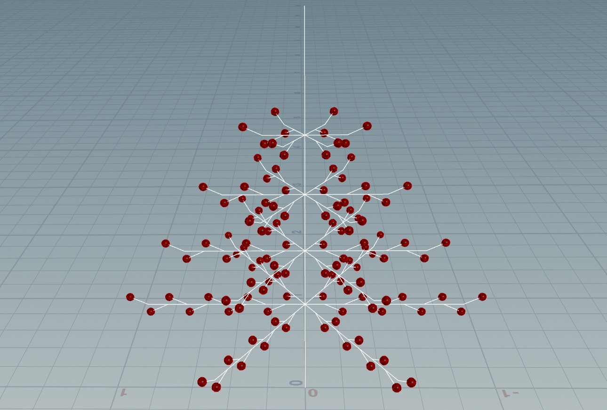

1. 

2. 

3.

https://primitivepineapplecollection.com/products/bethany-lowe-inspired-handcrafted-usa-german-style-goose-feather-tree-w-red-berries-8-copy
Iteration: 1

Iterations: 5

Iterations: 8

Rule one uses A to generate the circular branching pattern at each level, while rule two uses B to simulate the branches. And branches become fewer as the tree becomes higher. The symbol 'J' is used to add red fruits at the ends of each branch.