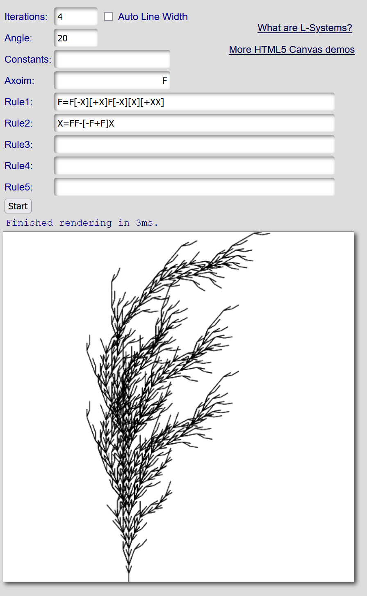

# lab03-grammars
## 1. Wheat grammar puzzle

## 2. Square grammar puzzle

## 3. Custom plant
Here is my kelp!

  
  

`F`: This is the general structure of the plant. I only wanted the leaves to grow out, so I made the stalk with `F` and the leaves with `X`.

`X`: This is the shape that is grown. I gave it a slight bend to the right so that the plant would gradually drift to the right as it is grown.

  
  
  
  

