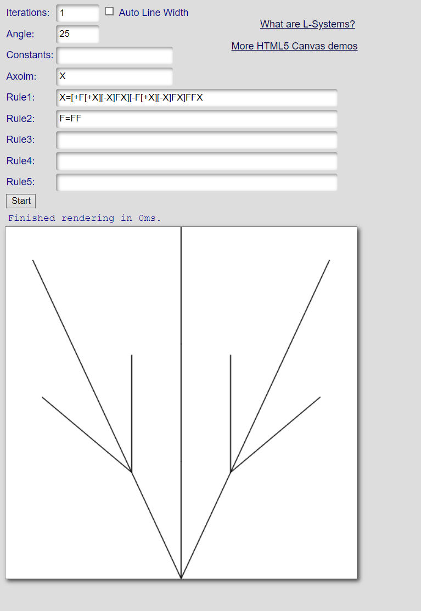

# lab03-grammars
Let's practice using grammars! For this lab, please pull up the L-system node in Houdini.

## 1. Wheat grammar puzzle

## 2. Square grammar puzzle

## 3. Custom plant
I chose to create a creosote bush, which is native to the Mojave desert.

Rule 1: X → X=[+F[+X][-X]FX][-F[+X][-X]FX]FFX

Purpose: Models the main symmetric branches of the bush, where I wanted each branch to have 2 little forks to simulate how wide the plant is.

Rule 2: F → FF

Purpose: Simulates the height of the main middle branch and other sub branches by just drawing straight up twice.
